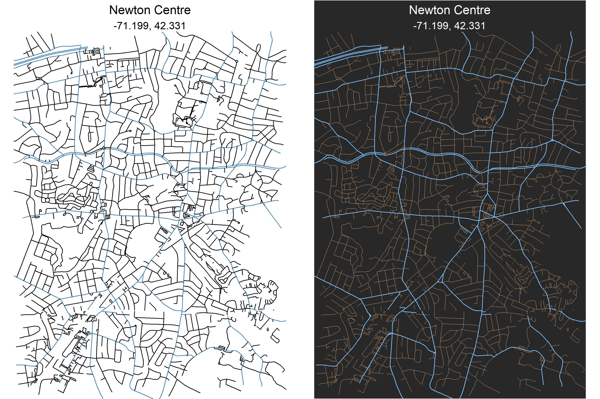

<!-- README.md is generated from README.Rmd. Please edit that file -->
streetmaps
==========

Just copying over the methodology found here: <https://ggplot2tutor.com/streetmaps/streetmaps/>. Code can be found in `figs-raw`, output shown below:

